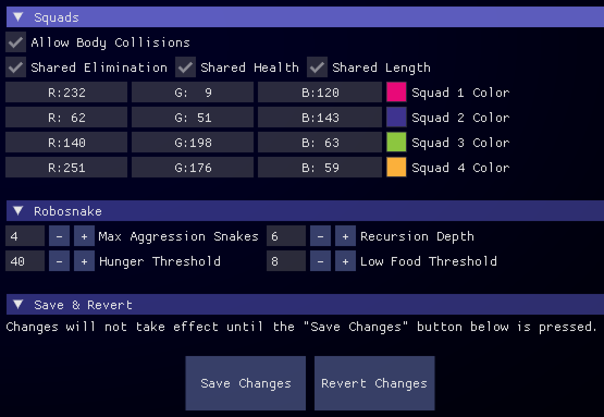

<h1 align="center">
	
</h1>
<h4 align="center">The desktop arcade-style game board for <a href="https://play.battlesnake.com" target="_blank">Battlesnake</a> 🐍</h4>

  <a href="#about">About</a> •
  <a href="#features">Features</a> •
  <a href="#download-and-install">Download and Install</a> •
  <a href="#managing-snakes">Managing Snakes</a> •
  <a href="#game-setup">Game Setup</a> •
  <a href="#how-to-play">How to Play</a> •
  <a href="#development-tools">Development Tools</a> •
  <a href="#configuration">Configuration</a> •
  <a href="#known-issues">Known Issues</a> •
  <a href="#troubleshooting">Troubleshooting</a> •
  <a href="#credits">Credits</a> •
  <a href="#license">License</a>

## About
Mojave is a desktop game board and development / debugging tool for [Battlesnake](https://play.battlesnake.com). It aims to bring an immersive "arcade" style experience to the game, with crisp neon visuals, an electrifying soundtrack, and a high amount of customizability.

Don't know Battlesnake? It's an online programming game played by developers from all over the world! Build a snake "bot" and be the last one slithering on the game board to win. You can use any language or technology that implements a web server. For more information on how to write your snake, and on the rules of the game, take a look at the [Battlesnake docs](https://docs.battlesnake.com/).

Battlesnake's mission is to make programming fun and accessible for everyone! With Mojave, we hope to make your Battlesnake experience even better!

## Features
* Customizable visuals for the ultimate sensory experience including a bloom filter, vignette and animations
* Supports all Battlesnake API versions from 2017 and up, simultaneously in one game - try your snake out against the best snakes from years past!
	* Note: Snakes built on API versions earlier than v1 can only play in Standard rules games
* Play with different sets of rules including Royale, Squads and Constrictor
* Pause, step forward and backward through games to debug your snake's behaviour
* Dump the JSON request/response being sent to/from your snake at any turn
* Includes the [Robosnake](https://github.com/smallsco/robosnake) as a built-in opponent to test your snake against
* Play as a human against your Battlesnake or play solo for that classic Snake experience!

## Download and Install

### Mac OS
* For Mac users, the minimum OS requirement is 10.14 (also called Mojave ... hey Apple, I used the name first!)
* Download the latest version of Mojave from the [Releases](https://github.com/smallsco/mojave/releases) page and extract the zip file into your Applications folder.
* The first time you run Mojave, you need to **right-click** on the application icon and select the **Open** option from the contextual menu. You will be presented with a warning dialog that the application cannot be opened because the developer cannot be verified. Click **Cancel**.
* Then, repeat the previous step. This time you will have an option to **Open** from the warning dialog. Click **Open** and Mojave will launch. You should only have to do this once per update.

Unfortunately, with each new Mac OS update, Apple makes it increasingly difficult to install and run software that has not been code signed by a member of their developer program. If you still have trouble launching the game despite following the above instructions, you can try running it using [LÖVE](https://www.love2d.org) 11.3 directly. Follow the instructions for Linux users (ignoring the bit about libcurl), but make sure to download the Mac version instead (the command string will look something like: `/Applications/love.app/Contents/MacOS/love --fused /path/to/mojave`)

Apple Silicon users: Mojave has not been tested on the M1. It won't work natively due to the use of shared libraries that will need to be recompiled - but it should run correctly under Rosetta emulation. Let me know if you've tried it!

### Windows
* For Windows users, the minimum requirement is Windows Vista.
* You will need to download and install the [Visual C++ 2017 Redistributable](https://go.microsoft.com/fwlink/?LinkId=746572) package from Microsoft if you don't already have it installed on your computer. [Get it here](https://go.microsoft.com/fwlink/?LinkId=746572).
* Once you have installed that, you can download the latest version of Mojave from the [Releases](https://github.com/smallsco/mojave/releases) page and extract the zip file somewhere on your computer.
* Open the `mojave3.exe` file to start!

### Linux
* For Linux users, any recent distribution should work.
* First, you will need to install the libcurl development package for your distribution:
	* For Ubuntu/Debian: `sudo apt-get install libcurl4-openssl-dev`
	* For Fedora/Centos: `sudo yum install libcurl-devel`
* You will then need to download and install [LÖVE](https://www.love2d.org) 11.3 for your Linux distribution. You can do this via your package manager, or download a package directly from the [LÖVE web site](https://www.love2d.org).
* Once you have installed that, you can download the latest version of Mojave from the [Releases](https://github.com/smallsco/mojave/releases) page and extract the zip file somewhere on your computer. Use the "Source Code" download rather than the Windows or Mac links.
* Launch the game from a terminal by calling `love` with the path to the extracted directory, i.e. `love --fused /path/to/mojave`. The `--fused` parameter is important, it will ensure that the game's save data is kept in the correct location.

### Building from Source
* Clone this repository to somewhere on your computer, or use the latest "Source Code" download from the [Releases](https://github.com/smallsco/mojave/releases) page.
* Download and install [love-release](https://github.com/MisterDA/love-release)
* Run the command `love-release -W64 -M` from the mojave directory.
* This will create a new folder inside the mojave directory, `releases`, containing zipped binaries for Windows and Mac OS X.

## Managing Snakes

To get started, you'll need to add at least one snake. Click the **Manage Snakes** button on the menu to get to the snake management screen. You will need to select the kind of snake that you would like to add, and press the **Add Snake** button to add it. Mojave supports four kinds of snakes:  

* **Battlesnake API** - Select this option to add a snake that uses the modern "V" Battlesnake API which was launched with the Global Arena. The version will be automatically be detected - snakes using V1 will have a preview rendered.
* **Old Battlesnake API** - Select this option to add a snake that uses the legacy Battlesnake API which changed from year to year and corresponded to a Victoria Live event. You will need to select the API year, 2017 and 2018 are suspported.
* **Robosnake** - The Robosnake is a tough computer-controlled snake built-in to Mojave. Use it as an opponent for testing your snake against! You can add as many as you would like, and will need to select its' color and head/tail types.
* **Human** - Add a Human snake if you would like to play, as a human, against one or more battlesnakes (or even just by yourself for the plain old Snake experience). You can control these snakes by using the arrow keys.

## Game Setup

To start a new game, click the **Create Game** button on the menu to get to the game setup screen. You will need to select the rules to play under (see the "How to Play" section below for a description of the different rules), the board size, and which of your snakes you would like to add to this game.

Note that there are a few restrictions on game creation:

* Only snakes using the modern Battlesnake API, or Human snakes may play using the Royale, Squads, and Constrictor game modes.
* The Royale and Constrictor game modes require a minimum of two snakes to play.
* The Squads game mode requires a minimum of two _squads_ to play.
* Only one Human snake may participate in a game.

## How to Play
For full game rules, see the official [Battlesnake Rules](https://docs.battlesnake.com/references/rules), the following is an abridged version:

### Standard
Under Standard rules, snakes may freely roam the game board, and lose some health on each turn. Food will spawn periodically on the game board. Eating food will restore a snake to full health, but will cause it to grow by one tile. A snake will die if it runs out of health, runs into a wall, or into the body of itself or another snake. If two snakes have a head-on-head collision, the smaller snake will be killed (and both will be killed if they are the same size).

### Royale
Under Royale rules, the edges of the board will slowly fill with hazards. If the head of a snake enters a hazard, that snake will take damage at an increased rate.

### Squads
Under Squads rules, all snakes are assigned to one of up to four squads. Snakes that belong to the same squad will share health and length, and may pass through each other's bodies without dying. However, if a snake dies, all other snakes on that squad will die as well.

### Constrictor
Under Constrictor rules, there is no food on the board. Instead, snakes will grow on every turn, with their tail locked to their starting position. This is also known as a Tron game.

## Development Tools

	

You can use the playback controls at the top right of the game window, while a game is taking place, to debug your snake:

* The "First" button will jump to the first turn of the game.
* The "Rewind" button will step back one turn.
* The "Play/Pause" button will pause and resume game playback (do note that pausing will only pause the UI, the game will continue to run in the background).
* The "Fast Forward" button will step forward one turn.
* The "Last" button will jump to the last turn of the game.
* The "Rematch" button will end the current game and start a new game with the same options.
* The "Close" button will end the current game and return to the main menu.

The "Debug" button located above each snake preview will copy the JSON data that was sent to that snake on the last turn, and that snake's response, to the clipboard.

You can also hover over a snake's preview image to see their latency for the current turn, and a graph of their latency over the course of the game.

## Configuration

	
	

### Appearance
* Tile Primary Color / Tile Secondary Color
	* This changes the color of background tiles on the game board.
* Food Color
	* This changes the color of food tiles on the game board.
* Hazard Color
	* This changes the color of hazard tiles on the game board (note: you cannot set the transparancy value because these tiles fade in and out).
* Fullscreen
	* This toggles full-screen mode.
* Vignette
	* This enables a [vignette](https://en.wikipedia.org/wiki/Vignette_(graphic_design)), which shades the background at the cost of performance.
	* The radius, opacity, softness, and color of the vignette can be adjusted.
* Bloom Filter
	* This enables a [bloom filter](https://en.wikipedia.org/wiki/Bloom_(shader_effect)), which brightens and blurs snakes at the cost of performance.
* Animations
	* This enables animations, specifically, making food spin and hazards fade in and out. They can be disabled for a small performance boost.
* Fade Tails
	* This fades out snake tails rather than have every square of the snake be opaque. Looks nice and doesn't affect performance, but can make it hard to tell living and dead snakes apart.
* Curve on Turns
	* This will draw snake bodies using curves when they make turns on the game board. Doesn't impact performance.

### Audio
* Enable Music
	* When enabled, plays background music on the menu and during the game.
* Enable SFX
	* When enabled, plays sound effects when snakes collect food or die.

### Gameplay
* API Timeout
	* How long to wait for API-based snakes to respond to a request. Defaults to 500ms.
* Human Timeout
	* How long to wait for human players to input a move. Defaults to 500ms.
* Game Speed
	* How long in seconds to wait between each tick of the game loop.
* Food Spawn Chance
	* The percent chance that a food will randomly spawn on the game board.
* Minimum Food
	* The minimum amount of food that will be present on the game board at all times.
* Maximum Health
	* The maximum amount of health that snakes can have.  
* Start Size
	* The starting length of each snake.

### Royale
* Shrink every N turns
	* One edge of the game board will become hazards every N turns, with N being the number you put here.
* Damage per Turn
	* If a snake head is in a hazard during a turn, this is the amount of damage they will be penalized.

### Squads
* Allow Body Collisions
	* If true, snakes on the same squad can pass through each other's bodies without penalty.
* Shared Elimination
	* If true, all snakes on the same squad will die if any of them die.
* Shared Health
	* If true, all snakes on the same squad will heal if any of them eat.
* Shared Length
	* If true, all snakes on the same squad will grow if any of them eat.
* Squad 1/2/3/4 Color
	* Sets the color for snakes that belong to a particular squad.

### Robosnake
* Max Aggression Snakes
	* The maximum number of snakes that can be on the board for Robo to be aggressive. If there are more than this many living snakes in play, Robo will become passive and only target food.
* Recursion Depth
	* How many turns Robo is allowed to predict ahead. Higher numbers make for a much tougher opponent, but will slow the game down.
* Hunger Threshold
   * When Robo's health dips to this value (or below) it will start looking for food.
* Low Food Threshold
   * If the food on the game board is at this number or lower, Robo will use a less aggressive heuristic and prioritize food.

## Known Issues
* Not all heads and tails are available. They are sourced from the [Battlesnake Exporter](https://github.com/BattlesnakeOfficial/exporter/tree/master/render/assets) which is providing PNGs under the AGPL license, unfortunately they do not provide all the heads and tails at this time.
* Robosnake cannot be used with non-standard game rules.
* The Debug button copies JSON data from the _previous_ turn, not the _current_ turn. This is non-intuitive but correct (it's showing the request/response, using the previous turn as input, to generate the current turn).
* Many snakes expect a square game board and their code will crash when using Mojave's default 17x12 board size. If you download a snake and find that it doesn't work, try using one of the "standard" square board sizes, i.e. 11x11.

## Troubleshooting
In the event the application experiences errors, you can reset the configuration and snakes by removing the data directory. This directory will be recreated the next time the application is launched.

On Mac OS, the data directory can be found at `/Users/<USER_NAME>/Library/Application Support/mojave3/`

On Windows, the data directory can be found at `C:\Users\<USER_NAME>\AppData\Roaming\mojave3\`

On Linux, the data directory can be found at `/home/<USER_NAME>/.local/share/mojave3/`

## Credits
Special thanks to the following third-party software, for whom without
Mojave would not be possible:

**Battlesnake concept, assets, and rules**  
Copyright ©2015-2018 Techdrop Labs, Inc. (d/b/a Dyspatch)  
Copyright ©2018-2021 Battlesnake Inc.  
License: AGPL 3.0  
<https://www.battlesnake.com>  
<https://github.com/BattlesnakeOfficial/exporter/tree/master/render/assets>
<https://github.com/BattlesnakeOfficial/rules>

**Atmospheric Interaction Sound Pack**  
License: Public Domain  
<https://opengameart.org/content/atmospheric-interaction-sound-pack>  

**Bloom Shader**  
Copyright ©2011 slime  
License: Public Domain  
<https://love2d.org/forums/viewtopic.php?f=4&t=3733&start=20#p38666>  

**Dear ImGui**  
Copyright ©2014-2021 Omar Cornut  
License: MIT  
<https://github.com/ocornut/imgui>  

**DKJson**  
Copyright ©2010-2013 David Heiko Kolf  
License: MIT  
<http://dkolf.de/src/dkjson-lua.fsl>  

**Kenney Game Icons**  
License: Public Domain  
<https://opengameart.org/content/game-icons>  

**libcurl**  
Copyright ©1996-2021 Daniel Stenberg  
License: MIT  
<https://curl.se/libcurl/>  

**libcurl Lua Bindings**  
Copyright ©2020 Cosmin Apreutesei  
License: Public Domain  
<https://luapower.com/libcurl>  

**LÖVE**  
Copyright ©2006-2021 LÖVE Development Team  
License: ZLIB  
<https://love2d.org>  

**LÖVE-ImGui**  
Copyright ©2016 slages  
License: MIT  
<https://github.com/MikuAuahDark/love-imgui>  

**Monoton Font**  
Copyright ©2011 Vernon Adams  
License: OFL  
<https://www.fontspace.com/monoton-font-f11955>  

**Moonshine**  
Copyright ©2017 Matthias Richter  
License: MIT  
<https://github.com/vrld/moonshine>  

**"Nebula Boss Fight"**  
Copyright ©2017 TeknoAXE  
License: CC BY 4.0  
<https://www.youtube.com/watch?v=vRRhVNwM6sc>  

**Robosnake Mk. III**  
Copyright ©2017-2018 Redbrick Technologies, Inc.  
Copyright ©2019 Scott Small  
License: MIT  
<https://github.com/smallsco/robosnake>  

**Space Laser**  
License: Public Domain  
<https://opengameart.org/content/space-laser>  

**Splashes**  
Copyright ©2016 love-community members  
License: ZLIB  
<https://github.com/love2d-community/splashes>  

**"Synthwave C"**  
Copyright ©2017 TeknoAXE  
License: CC BY 4.0  
<https://www.youtube.com/watch?v=-WYJ1Jh2kuI>

Extra special thanks to:  
[Erika Wiedemann](https://github.com/eburdon) - for her assistance in getting imgui working on Linux  
[Tyler Sebastian](https://github.com/tills13) - for his early work on multithreading  

## License
Mojave  
Copyright ©2017-2021 Scott Small and contributors

This program is free software: you can redistribute it and/or modify
it under the terms of the [GNU General Public License](LICENSE) as published by
the Free Software Foundation, either version 3 of the License, or
(at your option) any later version.

This program is distributed in the hope that it will be useful,
but WITHOUT ANY WARRANTY; without even the implied warranty of
MERCHANTABILITY or FITNESS FOR A PARTICULAR PURPOSE.  See the
[GNU General Public License](LICENSE) for more details.

## Why the name?
Because Rattlesnakes roam the Mojave desert, so it makes sense that Battlesnakes would roam in a virtual-Mojave :)